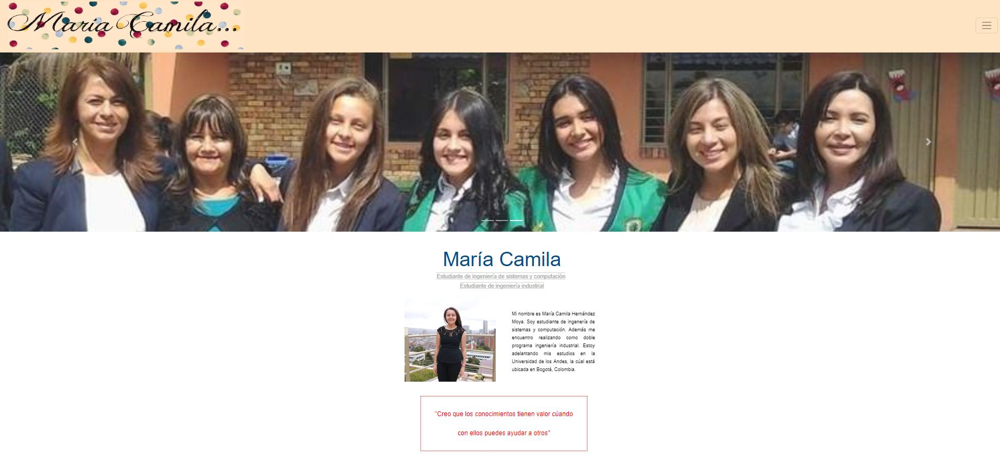

# María Camila's Personal Web Page

### Objectives

- Create my personal web page to show relevant information about myself and my projects.

- Develop my personal web page using HTML, CSS and JavaScript.

### How do you run?

- If you trie to run the proyect locally, you can deploy it with a http server. And remember, in the browser it is necessary to enable a script, which by default both mozilla and chrome block for security.

- But you can trie visit the web page with the following URL: https://mchernandez1.github.io/. And remember, in the browser it is necessary to enable a script, which by default both mozilla and chrome block for security.

### Author
María Camila Hernández - mc.hernandez
https://github.com/mchernandez1/mchernandez1.github.io

### Screenshot

### MIT License
This project is licensed under the MIT License - see the LICENSE.md file for details
